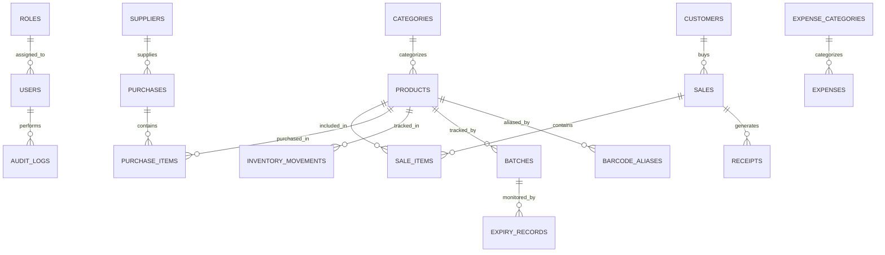

# Entity Relationship Diagram & Data Dictionary

## High-Level ERD Diagram

## Entity Specifications

Every database entity extends `BaseEntity` with:
- `id` (TEXT PRIMARY KEY, UUIDv4)
- `created_at` (DATETIME DEFAULT CURRENT_TIMESTAMP)
- `updated_at` (DATETIME DEFAULT CURRENT_TIMESTAMP)
- `deleted_at` (DATETIME NULL for soft deletes)

### 1. Users
- **Fields**: `id`, `username`, `password_hash`, `full_name`, `role_id`, `is_active`, timestamps.
- **Foreign Keys**: `role_id` -> `roles(id)`.
- **Indexes**: `idx_users_username` UNIQUE (`username`), `idx_users_role` (`role_id`).

### 2. Roles
- **Fields**: `id`, `name`, `permissions_json`, timestamps.
- **Indexes**: `idx_roles_name` UNIQUE (`name`).

### 3. Products
- **Fields**: `id`, `sku`, `barcode`, `name`, `category_id`, `unit`, `cost_price`, `selling_price`, `min_stock_alert`, `is_taxable`, timestamps.
- **Foreign Keys**: `category_id` -> `categories(id)`.
- **Indexes**: `idx_products_barcode` UNIQUE (`barcode`), `idx_products_sku` UNIQUE (`sku`), `idx_products_category` (`category_id`).

### 4. Categories
- **Fields**: `id`, `name`, `parent_id`, timestamps.
- **Foreign Keys**: `parent_id` -> `categories(id)`.

### 5. Suppliers
- **Fields**: `id`, `company_name`, `contact_name`, `phone`, `email`, `address`, timestamps.

### 6. Purchases
- **Fields**: `id`, `supplier_id`, `reference_number`, `total_amount`, `paid_amount`, `status`, timestamps.
- **Foreign Keys**: `supplier_id` -> `suppliers(id)`.

### 7. Purchase Items
- **Fields**: `id`, `purchase_id`, `product_id`, `quantity`, `unit_cost`, `subtotal`, timestamps.

### 8. Sales
- **Fields**: `id`, `invoice_number`, `customer_id`, `user_id`, `subtotal`, `tax_amount`, `total_amount`, `payment_method`, timestamps.

### 9. Sale Items
- **Fields**: `id`, `sale_id`, `product_id`, `quantity`, `unit_price`, `discount_amount`, `total`, timestamps.

### 10. Customers
- **Fields**: `id`, `name`, `phone`, `email`, `loyalty_points`, timestamps.

### 11. Expenses
- **Fields**: `id`, `category_id`, `amount`, `description`, `user_id`, timestamps.

### 12. Expense Categories
- **Fields**: `id`, `name`, timestamps.

### 13. Inventory Movements
- **Fields**: `id`, `product_id`, `movement_type` (IN/OUT/ADJUSTMENT), `quantity`, `reference_id`, timestamps.

### 14. Stock Adjustments
- **Fields**: `id`, `product_id`, `old_quantity`, `new_quantity`, `reason`, `user_id`, timestamps.

### 15. Settings
- **Fields**: `id`, `key`, `value`, timestamps.

### 16. Business Information
- **Fields**: `id`, `name`, `type`, `tax_id`, `address`, `phone`, timestamps.

### 17. Application Logs
- **Fields**: `id`, `level`, `module`, `message`, `details_json`, timestamps.

### 18. Audit Logs
- **Fields**: `id`, `user_id`, `action`, `resource`, `details_json`, timestamps.

### 19. Licenses
- **Fields**: `id`, `license_key`, `client_name`, `valid_until`, `is_active`, timestamps.

### 20. Backups
- **Fields**: `id`, `filename`, `filepath`, `size_bytes`, timestamps.

### 21. Receipts
- **Fields**: `id`, `sale_id`, `receipt_number`, `printed_at`, timestamps.

### 22. Batches
- **Fields**: `id`, `product_id`, `batch_number`, `cost_price`, `quantity`, timestamps.

### 23. Expiry Records
- **Fields**: `id`, `batch_id`, `product_id`, `expiry_date`, timestamps.

### 24. Barcode Aliases
- **Fields**: `id`, `product_id`, `alias_barcode`, timestamps.
